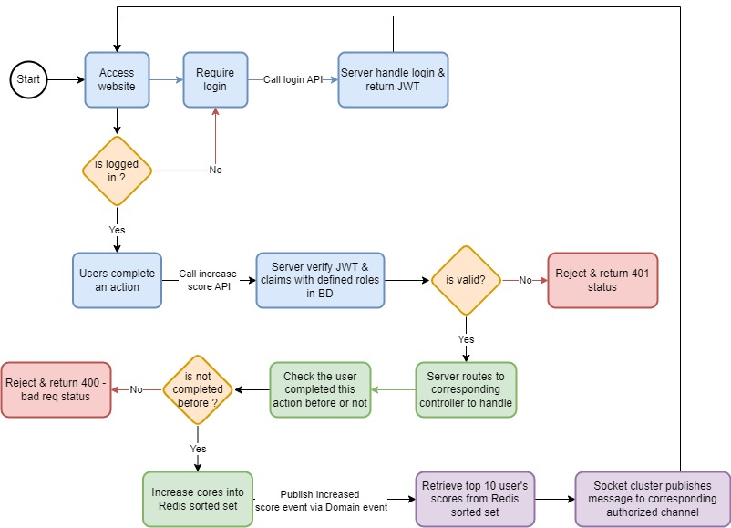
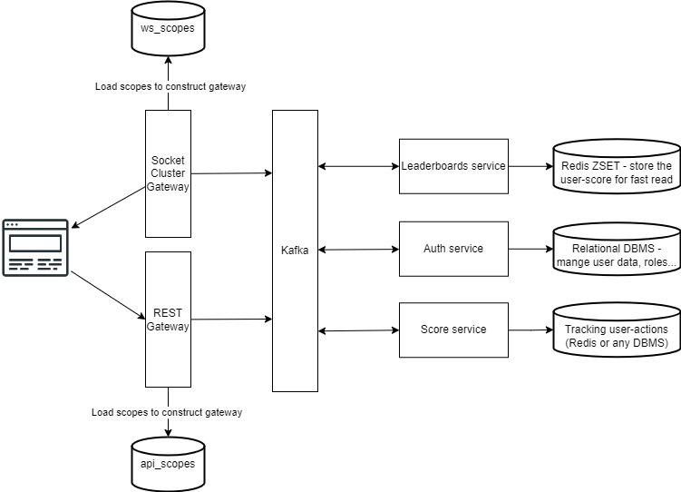

# 99Tech Code Challenge #1 #

Note that if you fork this repository, your responses may be publicly linked to this repo.  
Please submit your application along with the solutions attached or linked.   

It is important that you minimally attempt the problems, even if you do not arrive at a working solution.

## Submission ##
You can either provide a link to an online repository, attach the solution in your application, or whichever method you prefer.
We're cool as long as we can view your solution without any pain.

# Solution #

## Problem 4 ##
- Please refer src/problem4/index.ts for detail implementation.
- To run, install ts-node via `npm i ts-node -g` then `ts-node ./src/problem4/index.ts`

## Problem 5 ##
### General ###
- This BE design following the Clean Architecture & DDD in basic.
- Some used libs: Inversify, knex, express-validator, class-transformer, better-sqlite3,...
- Some patterns applied: DI, Singleton, Abstraction, SOLID principles,...
- Folder structure:
    - migrations & seeds: for migrating data.
    - src/core: Base classes/implementation
    - src/config: contain configuration
    - src/infrastructure: Infras layer, contains 3rd party service, DB connection,...
    - src/application: Application layer, contains business logic.
    - Others:
        - DB file: dev.sqlite3
        - Postman config: 99Tech-Problem5.postman_collection.json

### Migration ###
- Install knex cli `npm i knex -g`
- To start migration `knex migrate:up` & run seed file `knex seed:run` (DB has data already, so maybe you don't need to run this)
- To undo migration  `knex migrate:down`

### TODO ###
- Clearly separate the Application layer into Application & Domain layers. Where Domain layer contains the enterprise business rules & Application layers contain application logic. Currently, "entities" has Domain behavior.
- Add base controller & handle error more efficiently.
- Add middlewares: authentication, authorization, gzip response,...
- Config .env, checking valid env variables when starting the service (fail first approach) 
- We can re-construct the folders structure by modules, e.g. Score modules, Player modules,... based on the purpose.
- Use ubiquitous language more clearly for naming use cases.
- ...

## Problem 6 ##
### The flow diagram of score board ###
    

- Each color is a part need to handle:
    - Team Blue: Handle authentication/authorization feature:
        + Implement the JWT auth strategy (Can use: passport, jwt, RSA SHA-256 hash algorithm...)
        + Expose the API endpoint for retrieve access/refresh token (can use Redis with time-to-live for managing tokens strategy)
        + Construct the common routes with authentication/authorization middlewares.
        + Optional: check device fingerprints or IP to detect malicious actions. 

    - Team Green: Handle score business logic:
        + Check unique user - actions relational to prevent replay attack (we don't what action is but maybe we're not allow to increase score infinity for same complete action) - Use Redis or any DBMS to track
        + Construct and handle the domain events (loose coupling approach)

     - Team Purple: Handle living score:
        + Construct the common websocket to pub/sub on score channel (can use SocketCluster for better performance).
        + Implement auth for ws (communicate with Blue team)
        + Subscribe to "increased event" to publish message for Client (communicate with Green team)

### The architecture in general ###

- I draw for microservices case, but we can start with monolith modules:
    + REST & SocketCluster gateway are 2 communication gateways, that put in Interface Layer in our Clean architecture.
    + Kafka is the Domain Events (in-memory for monolith)
    + Each services are a module in our monolith
    + Databases: Redis (separate by keys) and MySQL (separate by tables) 

- To migrate from monolith to microservices, we just replace corresponding parts.
- Auth service can become a SSO service.

- <em>Note: This is my intentional approach only, need to discuss & improve</em>.